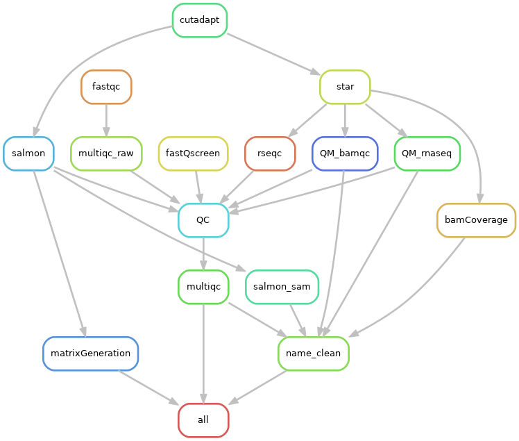
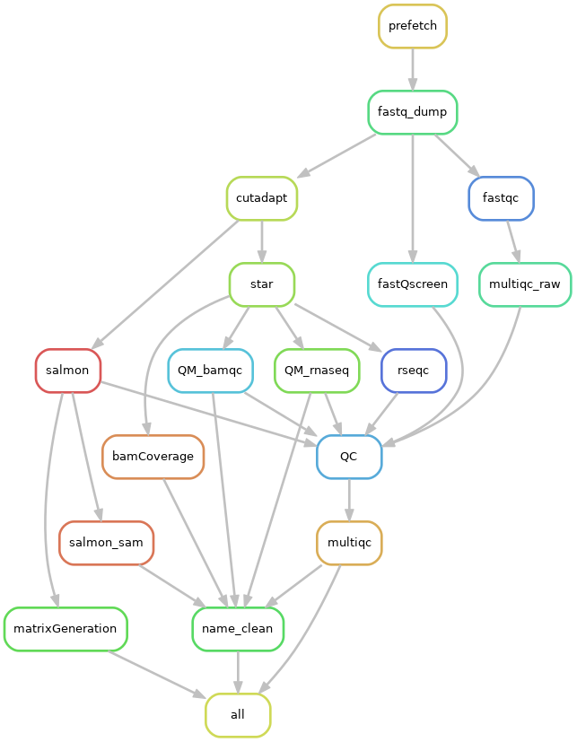

# Furey Lab RNA-seq

## Quickstart

This analysis utilises a snakemake pipeline to process RNA-seq data. Once the pipeline has been cloned to the analysis directory (*preferably in scratch space*) using the command:

```
git clone https://sc.unc.edu/dept-fureylab/rna_snakemake.git
```

The only prerequisite for running the pipeline is to load Python 3 using:

```
module load python/3.6.6
```

and then running the pipeline using a command like:

```
sbatch -o snakePipe.log -e snakePipe.err -t 1-0 -J snakePipe --wrap='snakemake --printshellcmds --jobs=100 \
--cluster-config cluster_config.json --cluster "sbatch --mem={cluster.mem} \
-t {cluster.time} -n {cluster.ntasks} -o {cluster.output} -e {cluster.err} \
-J {cluster.jobname}"'
```
A more complete guide to setting up and running the pipeline is below.

The three main files that may be edited before running the pipeline are:

- **Snakefile**. The snakemake submission script which is automatically called when executing the snakemake command.
- **project_config.yaml**. Contains sample IDs for fetching from sra or processing local files, software parameters, and pointers to files needed to run the pipeline.
- **cluster_config.json**. The SLURM configuration file. This file contains general rule submission parameters that can be customized for specific rules. For example, the star step of the pipeline requires more that the default 15GB of memory, and so is bumped up to 50GB for the submission of these jobs.

It's likely that you'll only need to edit the project configuration file.

## Setting up the pipeline

In most cases, setting up the pipeline involves customizing only a few fields the project configuration file, **project_config.yaml**.

- Specifying an analysis name, checking the analysis organism and genome build matches your analysis, and setting the read length. Supported genome builds can be checked in the "Genome Indexes" section at the bottom of the project configuration file.
- Entering either paths to samples stored locally, or SRA IDs to sample. For SRA IDs, the "useSRA" flag should be changed to "TRUE".

#### Setting up project_config.yaml

##### Analysis-specific parameters

There are multiple fields within the project configuration file that will be specific for each analysis:

- **projectName** will be used in various QC and summary files, and so should be set to something informative for your analysis, e.g. "Crohns_human_colon" or "Crohns_mouse_macrophage". When the pipeline saves various project-specific files to permanent space, a date will automatically be appended to this projectName. **The project name cannot contain any whitespace characters!**
- **organism** should be set to either "human" or "mouse"
- **genomeBuild** can be set depending on the build files included in the config files. At the time of writing (June 2020), the pipeline currently supports hg19, hg38, mm10, and CC027. More information is provided at the end of this readme for generating the required files for additional genome builds.
- **readLength** should match the read lengths in the input sequence files. Samples of different read lengths should be processed separately through independent runs of the pipeline. Genome indexes for specific read lengths (especially for star) will need to be generated before running the pipeline. At the time of writing (June 2020), the pipeline supports hg19 (50bp), hg38 (50bp, 75bp, 150bp), mm10 (50bp, 75bp, 150bp), and CC027 (150bp). If the read length is slightly more than 50bp, 75bp, or 150bp, set this to the one of these and the pipeline will trim reads down to these read lengths during the adapter trimming step.

##### Samples

Specifying samples for analysis is simple, but should be formatting within the **"samples"** section of the project configuration file in the following ways:

<ins>Local Samples<ins/>

For each sample, there should a path pointing to the base directory for each sample that contains a "fastq" directory. This fastq directory should contain only two gzipped fastq files files, the forward and reverse gzipped fastq files (or just the forward gzipped file in the case of single end data). For example:

```
samples:
  - /proj/fureylab/data/RNA-seq/human/colon_tissue/nonIBD/172/
  - /proj/fureylab/data/RNA-seq/human/colon_tissue/nonIBD/174/
```

The specified directories are formatting in the following way:

```
/proj/fureylab/data/RNA-seq/human/colon_tissue/nonIBD/172/
├── fastq
│   ├── 172_18-172_18_C_NI_RNA_GTGAAA_GTGAAA_S11_L002_R1_001.fastq.gz
│   └── 172_18-172_18_C_NI_RNA_GTGAAA_GTGAAA_S11_L002_R2_001.fastq.gz
```

In the case of merged fastq files, the two merged should be placed at the top level of the fastq directory with the original files being placed into a directory with fastq. An example of these types of cases below:

```
/proj/fureylab/data/RNA-seq/mouse/Peanut/SIEC_PBS/20/
└── fastq
    ├── A3_CRRA200014404-1a_merge_L1_L1_1.fq.gz
    ├── A3_CRRA200014404-1a_merge_L1_L1_2.fq.gz
    ├── MD5.txt
    └── orig
        ├── A3_CRRA200014404-1a_H57L5DSXY_L1_1.fq.gz
        ├── A3_CRRA200014404-1a_H57L5DSXY_L1_2.fq.gz
        ├── A3_CRRA200014404-1a_HV5JWDSXX_L1_1.fq.gz
        └── A3_CRRA200014404-1a_HV5JWDSXX_L1_2.fq.gz
```

Although the pipeline can handle both single and paired-end data, a single analysis should not contain both single and paired-end data.


<ins>SRA Samples<ins/>

Samples can also be directly processed from SRA by specifying SRA IDs for each sample. These should be specified within the "samples" section of the project configuration file in the following way:

```
samples:
  - SRR5223500
  - SRR5223505
```

**A single run of the pipeline cannot contain both SRA IDs and local file pointers.**

##### Flags and options

There are various flags/options that you may need to change depending on how you want to process your data:

- **useSRA** will need to be set to _TRUE_ if the "samples" are set to include SRA IDs.

- **moveOutFiles** will always be set to _FALSE_ on the initial run through the pipeline. Once the pipeline has completed, this can be set to TRUE to move analysis and sample-specific files to permanent space.

- **projectDir** specifies where analysis-specific files will be saved to. A directory will be created here using the _projectName_ option and system date. Probably to leave this as the default unless otherwise instructed by Terry.

- **adapterTrimming** is set to TRUE be default. If set to FALSE, the pipeline will create "trimmed" files to maintain file dependencies, but these are just copies of the input fastq files.

- **quantification**, at the time of writing, can only be set to "salmon". An addition "rsem" option may be added in the future.

- **deconvolution** can be set to TRUE to perform unmix tissue deconvolution. Currently only set up to work on colonic mucosal tissue.


- **end** can be set to "paired" or "single" depending on library preparation.

- **countGeneSymbols** dictates whether the count matrix rows are ensembl IDs or gene symbols. Although gene symbols are initially easier to work with, I strongly recommend starting with ensembl IDs to allow you to easily obtain biotype information for each gene. The default is set to "tx2gene_ensembl", but can be changed to "tx2gene_symbol" if the transcript ID to gene ID conversion file has been generated and is in the build section of the project configuration file.

##### Software parameters

Software parameters for all tools used by the pipeline are also included in the pipeline. If you're wondering "do I need to change these?", then you probably do not need to change these.

## Pipeline dependency rulegraph

The pipeline is designed to be run on a system using the SLURM job scheduler (like UNC's longleaf). The rulegraph for the pipeline can be generated using the command:

```
snakemake --rulegraph | dot -Tpng > Snakemake_graph.png
```

The dependency rulegraphs for this version of the pipline are shown below:

<ins>Running local files</ins>

\

<ins>Running files directly from SRA</ins>

\

## Running the pipeline

There are three main steps to running the pipeline in most cases.

1. Cloning the snakemake pipeline to the analysis directory. This should be a directory within your scratch space ("/pine/scr/b/p/bpk" where bpk is my onyen, and "/b/p/" are the first two letters of my onyen). You will be asked for your username and password, this will be your onyen and password (the same used to log onto longleaf)

```
git clone https://sc.unc.edu/dept-fureylab/rna_snakemake.git
```

2. Snakemake requires python/3.6.6 to be loaded, which can be done using the following command:

```
module load python/3.6.6
```

3. After the _project_config.yaml_ file has been set up, the pipeline can be run in the directory where the _Snakefile_ is located using a command like below. The pipeline uses relative paths for the pipeline files, **so it is important that you do not move any files**. This command will kick the pipeline off, submitting the pipeline as its own SLURM job and each individual step as a SLURM job.  'results' and 'temp' directories will be created and final files of interest for each input sample will be found in the 'results' directory.

```
sbatch -o snakePipe.log -e snakePipe.err -t 1-0 -J snakePipe --wrap='snakemake --printshellcmds --jobs=100 \
--cluster-config cluster_config.json --cluster "sbatch --mem={cluster.mem} \
-t {cluster.time} -n {cluster.ntasks} -o {cluster.output} -e {cluster.err} \
-J {cluster.jobname}"'
```

4. To check which jobs are running or queued, use the command:

```
squeue -u onyen
```

5. Throughout the running of the pipeline, the _snakePipe.err_ file will contain information about jobs that have completed, or whether jobs have run into errors. If the pipeline has finished completely without errors, the end of the _snakePipe.err_ file will state "X of X steps (100%) done". If the pipeline stops are any point due to an error, you can rerun the pipeline using same commands. The pipeline will pick up from where it stopped. You may want to change the names of the "snakePipe.log" and "snakePipe.err" files so that they do not get overwritten if rerunning the pipeline is necessary!

6. If you wish to move output files for each sample to permanent space, once the pipeline has change the _moveOutFile_ flag within  the project configuration file to _TRUE_ and run the below command in the same directory as the Snakefile. This will move the results directories for each sample to a directory named "snakemakeRNA_[build]" within the directory specified in the project configuration file and analysis-specific files to the directory specified in the project configuration file under _projectDir_.

```
snakemake --printshellcmds --jobs=100 \
--cluster-config cluster_config.json --cluster "sbatch --mem={cluster.mem} \
-t {cluster.time} -n {cluster.ntasks} -o {cluster.output} -e {cluster.err} \
-J {cluster.jobname}"
```

**NOTES AND POTENTIAL PITFALLS**

- The _moveOutFiles_ flag allows you to move all of you output files to the sample directory and save analysis specific files to a directory set by the _projectDir_ parameter. _moveOutFiles_ **should be set to FALSE initially**. Once the pipeline has run fully and the output files have been generated, this flag can be set the TRUE and the pipeline can be rerun using the command specified above in step 6. The _projectDir_ parameter should remain fixed unless otherwise specified by Terry.
- The _cluster_config.yaml_ file is currently set up to utilise threading on longlead. Although the speed up in processing time is massive when threading, queue times on longleaf can sometimes be an issue. If you're finding jobs are queued in the "hov" partition for longer than you'd like, you can switch the "ntasks" parameter of cutadapt, star, and salmon sections of the _cluster_config.yaml_ file from 4 to 1.
- If you get the error like the one below in any of your log files, this is because a job ran out of memory. You will need to edit the memory requirement for this job in the _cluster_config.yaml_ file. Similar errors can also be produced if a job goes over the supplied time limit (which I've set to 5 hours for each job. I'd be suprised if any job runs longer than 5 hours based on current parameters).
- The "name" section of the project_config.yaml **file cannot contain spaces**. This will project errors when it comes to the QC steps of the pipeline.
- The scratch partition does have some kind of hard limit on usage that you may run into if you're processing a large number of samples (50+). If jobs are halting due to some kind of "slurmstepd" error regarding "out of disk space", you will have to cut your analysis into multiple batches.
- I've found that random failures during the initial fetching of samples from SRA are fairly common. This seems like a network/overload issue that we can't fix. In these cases, when the pipeline shuts down due to an error, the majority of samples will have downloaded. By restarting the pipeline using the same submission command, the pipeline will try to fetch these samples again (which will hopefully work this time!)

```
slurmstepd: error: Detected 3 oom-kill event(s) in step 59882717.batch cgroup. Some of your processes may have been killed by the cgroup out-of-memory handler.
```

## Preparing genome-specific files

For each genome build, several files will need to be generated and added to the project_config.yaml for the pipeline to run successfully:

- salmonIndex
- starIndex
- rseqcModel
- multiqcConfig
- featureFile
- tx2gene_ensembl
- tx2gene_symbol

If you're working with hg19, hg38, mm9, or mm10, this has probably already been done. Below if a brief guide to generating these index files.

#### Star and Salmon indexes

Generation of the **salmon index** and **star index** files are covered in the [RNA-seq pipeline indexing SOP](https://sc.unc.edu/dept-fureylab/sops/-/tree/master/Pipelines). If the indexes have already been generates, you just need to provide a path to the directory which contains the index files.

Once indexing has been completed, index directories need to be named carefully to be recognised by the pipeline. For example, in the hg38 build section of the configuration file, the pointer specified for hg38 star indexes is _"/proj/fureylab/genomes/human/hg38_reference/star_2.7.3a"_, which contains three read-specific indexes:

```
/proj/fureylab/genomes/human/hg38_reference/star_2.7.3a
├── star_150bp
├── star_50bp
└── star_75bp
```

Based on the input read length, the pipeline will modify the path to fix the necessary read length. The hg38 pointer for salmon, _"/proj/fureylab/genomes/human/hg38_reference/salmon_1.2.1"_, also works and is formatted a similar way;

```
/proj/fureylab/genomes/human/hg38_reference/salmon_1.2.1
├── salmon_50bp
└── salmon_75bp+
```

Unlike star, which requires a specific index for each read length, salmon is pretty robust of different read lengths. Setting up indexing for salmon does not change when read lengths are greater than 75.

#### Other files

The **rseqcModel** file is a bed file containing gene locations within the genome. These files can be downloaded from the [UCSC table browser](https://genome.ucsc.edu/cgi-bin/hgTables?command=start) or from the [RSeQC site](http://rseqc.sourceforge.net/#download-gene-models-update-on-08-07-2014).

The **multiqcConfig** file is specific to each genomeBuild and should be placed within the bin directory once generated. Use the config file from another genome as a template (e.g _bin/multiqc_config_hg38.yaml_). The only thing you will need to change for a new genome build is the _fastqc_theoretical_gc_ section. If you want this to show up in your final multiqc report, you will need to generate a new _fastqc_theoretical_gc_mm10_txome.txt_ file by following [Mike Love's instructions](https://github.com/mikelove/fastqcTheoreticalGC). **This file is not necessary, I just like it in my fastqc report for illustration purposes.** If you decide that you do not need to generate this file, remove the _fastqc_config_ section from your multiqc config file.

The **featureFile** is the gtf file that was used to index your genome of interest. Terry will be able to point you to this file. The only potential pitfall here is that this file will need to be gzipped (if the file ends .gtf, use the gzip command to zip the file).

**tx2gene** files are used to generate count matrices. These files contain a conversion from transcript to gene IDs which are comma separated. In the case of CC, GENCODE, or Ensembl genomes, all you'll need is the corresponding tx2gene_fasta.sh shell script, located in the bin directory of the pipeline, and a transcript file used for indexing (in the case of GENCODE/Ensembl) or feature file used for indexing (for CC genomes). Examples of how to run these bash scripts is below.

<ins>GENCODE/Ensembl genomes<ins/>
```
bash tx2gene_gencode_fasta.sh GENOME.transcripts.fa.gz tx2gene.GENOME
bash tx2gene_ensembl_fasta.sh GENOME.transcripts.fa.gz tx2gene.GENOME
```
<ins>CC strain genomes<ins/>
```
bash tx2gene_CCstrains_fasta.sh GENOME.gtf.gz tx2gene.GENOME
```
