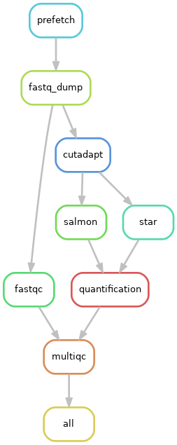

# Furey Lab RNA-seq

This analysis utilises a snakemake pipeline to process RNA-seq data. The only prerequisite to running the pipeline is to load Python 3 using:

```
module load python/3.6.6
```

project_config.yaml contain sample IDs for fetching from sra, and sample information that is used by R during downstream analysis.

cluster_config.json is a SLURM configuration file. This file contains general rule submission parameters that can be customized for specific rules. For example, the star step of the pipeline requires more that the default 15GB of memory, and so is bumped up to 50GB for the submission of these jobs.

### Running the pipeline

The pipeline is designed to run on a system using the SLURM job scheduler on UNC's longleaf HPC. The rulegraph for the pipeline can be generated using the command:

```
snakemake --rulegraph | dot -Tpng > Snakemake_graph.png
```



To run the pipeline completely, use:

```
sbatch -o snakePipe.log -e snakePipe.err -t 1-0 -J snakePipe --wrap='snakemake --printshellcmds --jobs=25 \
--cluster-config cluster_config.json --cluster "sbatch --mem={cluster.mem} \
-t {cluster.time} -n {cluster.ntasks} -o {cluster.output} -e {cluster.err} \
-J {cluster.jobname}"'
```

This command will kick the pipeline off, submitting the pipeline as its own SLURM job and each individual step as a SLURM job.  'results' and 'temp' directories will be created and final files of interest for each input sample will be found in the 'results' directory.
