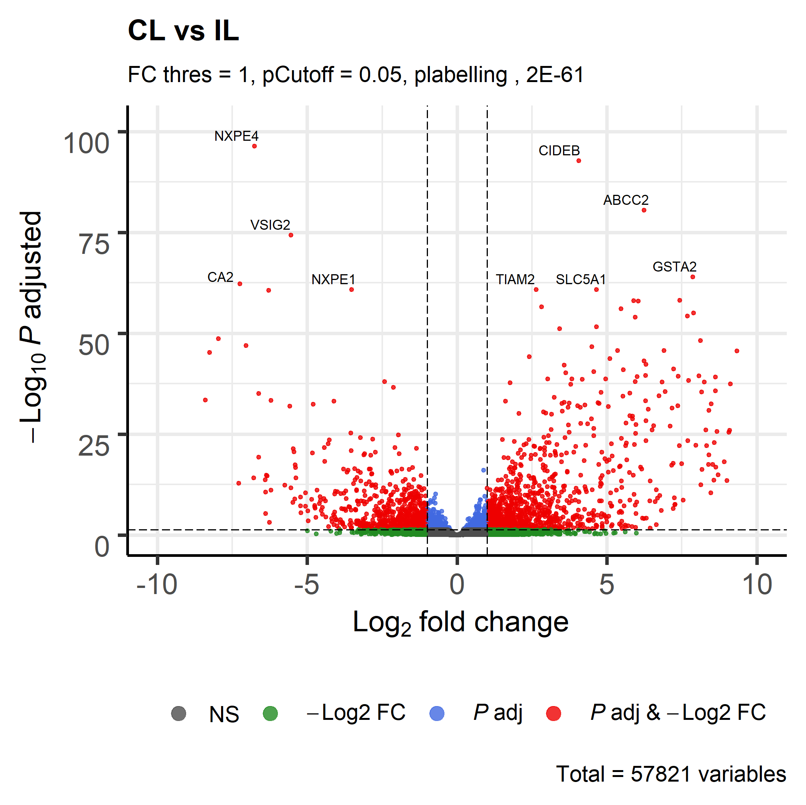
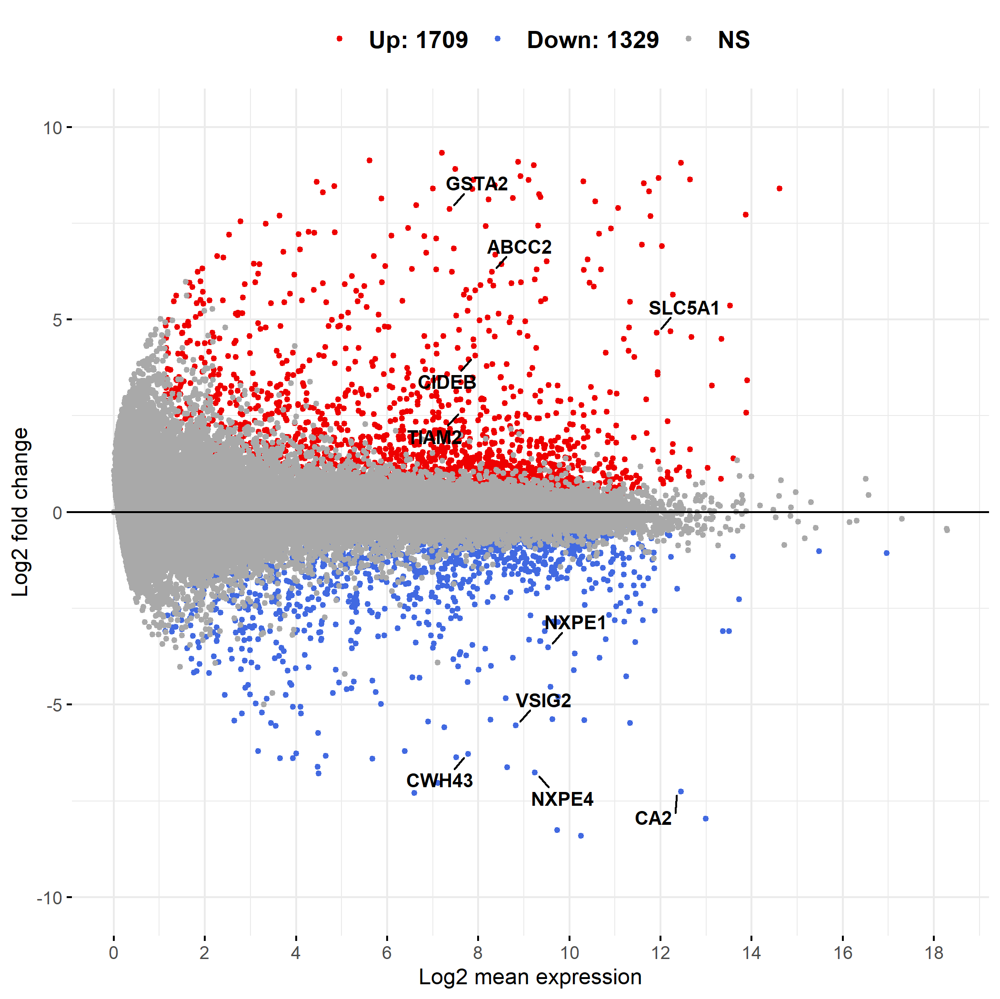
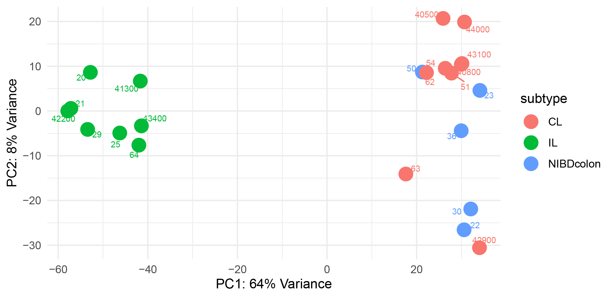
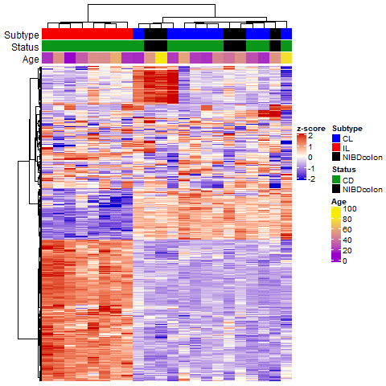

2020.06.19 - Ben Keith

# Downstream RNA-seq Analysis Tutorial

This is a basic tutorial for performing downstream analyses and plotting such as:

- Differential expression analysis (DESeq)
- Batch and covariate correction
- MA plots
- Volcano plots
- Heatmaps (Hierarchical Clustering)
- Boxplots
- Venn plots
- Principal Components Analysis (PCA)
- Enrichment analyses (both within R and externally through tools such as Enrichr)

This analysis concentrates on the analysis of human data, but files for mouse data (mm10) can be changed out to produce the exact same outputs.

Other useful tutorials with more in depth information on some of the tools used here:

- [DESeq2](http://bioconductor.org/packages/release/bioc/vignettes/DESeq2/inst/doc/DESeq2.html)
- [Analysis of RNA-seq data](https://bioconductor.org/packages/release/workflows/vignettes/rnaseqGene/inst/doc/rnaseqGene.html)
- [Enhanced Volcano](https://www.bioconductor.org/packages/release/bioc/vignettes/EnhancedVolcano/inst/doc/EnhancedVolcano.html)
- [PCAtools](https://bioconductor.org/packages/release/bioc/vignettes/PCAtools/inst/doc/PCAtools.html)
- [Complex Heatmap](https://jokergoo.github.io/ComplexHeatmap-reference/book/) and Complex Heatmap [FAQs](https://bioconductor.org/packages/release/bioc/vignettes/ComplexHeatmap/inst/doc/most_probably_asked_questions.html)

### Which R version (3.6.0), installing packages, and setting up the analysis environment

At the time of writing, all packages used in this tutorial are compatible with R 3.6.X. I recommend R 3.6.0, but with the release of R 4.0, bioconductor packages will graduate shift to R > 4.0.

All packages will be installed through:

```
install.packages('packageName')
```

or

```
BiocManager::install('packageName')
```

or

```
devtools::install_github('git/package')
```

##### Ben's function file

For some of the analyses mentioned here, you will need to source a file into your environment to have access to a number of functions. The file, called _RNAseqFunctions.R_ is in the downstreamAnalysis folder of the snakemake_RNA git. Once in R, use the command:

```
source("path/to/RNAseqFunctions.R")
```

The first time you try to do this, will probably get prompts that a specific package is not installed. Keep installing the required packages and resourcing the file until everything loads correctly and the functions are listed in your global environment.

##### Count, Metadata, and lookup Files

To perform this analysis, you will need a count a metadata file containing information about each of your samples. The count file may have already been generated by the snakemake RNA pipeline, although a custom count matrix file can be generated by following the instructions in the _Custom_count_matrix_generation.md_ tutorial. The links to the RNA-seq analysis and DESeq2 documentation above provide more information about how these files should be formatted, but I use a couple of custom functions for importing these files into the environment:

```
coldata <- read_delim("metadataFile.txt", delim = "\t", col_names = TRUE)
coldata <- tibble2dataframe(coldata)
cts <- read_delim("countMatrix.txt", delim = "\t", col_names = TRUE)
cts <- tibble2dataframe(cts); cts <- round(cts);

# THIS MUST RETURN TRUE!
all(rownames(coldata) == colnames(cts))
```

**For DESeq the rownames of the metadata table must equal the column names of the count file.**

By importing the data as a tibble, rather than a data frame, you can fix data type issues that might arise further downstream in the analysis. Some functions I use require a data frame, though, so I convert back to a data frame but retain the correct data type for each column.

The last pre-analysis piece you set up you will have do is regarding the import of a lookup file for converting ensembl IDs to gene IDs. The files _"GENOMEBUILD_ensembl2gene.txt"_, can be found in the downstreamAnalysis folder of the snakemake_RNA git repo and can be loaded into your environment like any other file:

```
ens2gene <- read.table(hg38_ensembl2gene.txt", sep="\t", header = TRUE)
```

For safety and compatibility with my functions, name this _ens2gene_. As well as gene ID conversion information, this file also provides gene biotype information for filtering specific genes, such as protein coding or lncRNAs, from you dataset.

### Downstream analysis

Going into this section, I assume you have your **count matrix**, **metadata**, **lookup file** and **function file** in your environment.

##### DESeq2

The example below provides very simple DESeq analysis example when you have identified the condition or variable that you want to test for. DESeq2 is a very well documented tools, and more information can be found in Mike's vignettes.

```
dds <- DESeqDataSetFromMatrix(countData = cts,
                              colData = coldata,
                              design = ~ status)

dds <- DESeq(dds)

# The contrast argument here is ensuring that +ve log2FC means higher
# in CD samples.
results(dds, contrast = c("status", "CD", "NIBD"))

# Adding gene ID and biotype columns to our results output
res$ensembl <- rownames(res)
res <- join(as.data.frame(dds), ens2gene, by="ensembl")

# Ordering the output by adjusted p-value
res <- res[order(res$padj),]
```

In some scenarios, there will be a number of covariates in your design formula and sometimes there may be a number of numerical covariates. To avoid issues. it is important that these numerical covariates are on the same scale. This can be easily done using something like the below:

```
dds <- DESeqDataSetFromMatrix(countData = cts,
                              colData = coldata,
                              design = ~ batch + age + TIN + status)

dds$age <- centerAndScale(dds$age)
dds$TIN <- centerAndScale(dds$TIN)
dds <- DESeq(dds, minRep=Inf)
```

Your results can be exported using a command like below:

```
write.table(res, file = "DESeq_results.txt", sep="\t", quote=FALSE, col.names=NA)
```

###### Quick word on batches and corrections
DESeq should be performed **without any normalization or correction** of the data. later I will mention a few different ways that batches and covariates can be corrected, but the count matrix that is input into DESeq should not be motified. Instead any covariates or batches should be entered into the DESeq design formula.

##### Volcano and MA plots

Using your DESeq results object, _res_, you plot the data in a number of useful ways. A couple of plots we regularly use are volcano and MA plots.

For volcano plots, I use the package EnhancedVolcano, which is really well documented and can probably be modified for anything you're trying to plot.

```
EnhancedVolcano(res, lab = res$gene_id, pLabellingCutoff = 2E-61,
                x = "log2FoldChange", y = "padj", ylab = bquote(~-Log[10]~italic(P)~adjusted),
                FCcutoff = 1, pCutoff = 0.05, colAlpha = .8, pointSize = 1,
                drawConnectors = TRUE, widthConnectors = 0.2, legendPosition = "bottom",
                title = "CL vs IL",
                subtitle = "FC thres = 1, pCutoff = 0.05, plabelling , 2E-61 ",
                legendLabels = c("NS", bquote(~-Log2~FC), bquote(~italic(P)~"adj"),
                                 bquote(~italic(P)~adj~"&"~-Log2~FC)),
                ggsave("volcano_ILCL.pdf", device = "pdf"))
```



Other potential parameters of interest:
- selectLab - Allows you to pass a vector of genes names to label specific genes
- colCustom - pass a vector of color names of hex values to color points to a custom filter

I produce MA plots using ggpubr. For a quick glance, you can produce MA plots straight after performing DESeq using the function:

```
plotMA(res)
```

For nicer looking plots, we can use the ggmaplot function:

```
maplot <- ggmaplot(res, fdr = 0.05, fc = 1, size = 1,
                   palette = c("red2", "royalblue", "darkgray"),
                   genenames = as.vector(res$gene_id),
                   ggtheme = ggplot2::theme_minimal(),
                   legend="top", font.label = c("bold", 10),
                   label.rectangle = FALSE, font.legend = c("bold",12),
                   font.main = "bold",
                   top = 10)
maplot <- maplot + ylim(c(-10,10)) + ggsave("maplot_ILCL.png", device = "png")
```



Other potential parameters of interest:
- label.select - Here I am plotting the top 10 genes in terms of padj (top = 10), but you can select genes by passing them through the parameter label.select. At the time of writing, the version of ggpubr that I am using does not have this parameter available through the bioconductor version of ggpub, so you may need to install ggpubr from the developers github!

##### PCA

PCA can be performed as part of your QC as well as a part of the downstream analysis to visualize differences among your samples. PCA well detect large sources of variance within your dataset. With this in mind, a number of things can affect PCA and must be taken into account:

- Batch effects
- Uncorrected covariates (transcript integrity, specific cell-type proportion differences, sex, age)
- Number of genes as input
- outliers genes (genes anomalously highly expressed in one or a small subset of samples)

Along with the above, PCA assumes that your data is normally distributed, which means that the input data must be normalized and transformed. The below code will take you through from raw count data to a PCA plot using a subset of protein-coding genes where filtering has been performed to remove potential outlier genes. **For correcting for batch effects, refer to the _Batch effects_ section.**

```
# Data normalization
dds <- DESeqNormalize(counts = cts, coldata = coldata, designFormula = ~ status)

# Transform data
vsd <- transformData(dds, trans="vst", blind=TRUE)
vsd <- as.data.frame(assay(vsd))

# Threshold and filter genes by biotype
# hist(as.matrix(vsd)) to view the general distributions of values to select a normThres
# table(coldata$variable) to see how sample numbers break down. You want to select a value for
# sampleThres less than or equal to the LOWEST number of samples in the variable of interest to
# avoid filtering out group-specific genes.
# table(ens2gene$biotype) to view the possible biotypes that you could filter for.
vsd.pcThres <- thresholdBiotype(vsd, normThres = 5, sampleThres = 6, biotype = "protein_coding")

# Variance filter
vsd.pcThres.var <- varFilter(vsd.pcThres, variableGenes = 500)

#PCA
rnaSeqPCA(vsd.pcThres.var, coldata, color = "subtype", \
  savePlot = TRUE, saveTitle = "pca_ILCL", legend = TRUE, pointSize = 5, plotLabs = TRUE)

```


rnaSeqPCA has a number of functions that may be useful:
- the _proportional_ flag can be set to creat a PCA plot that is proportions to the variation to the axes of interest.
- _x_ or _y_ parameters can be set to look at a specific PC, e.g. x = "PC2", y = "PC3" would plot PC2 vs PC3
- The _loadings_ flag can be set to TRUE to output PCA loadings for the top 5 PCs.
- The _plotly_ flag can be set to TRUE to produce an interactive plots
- The _returnData_ flag can be set to TRUE and pointed into a variable to save the PC values for each sample, which is useful for performing correlation analyses of PCs and covariates.

##### Heatmaps

```
```

