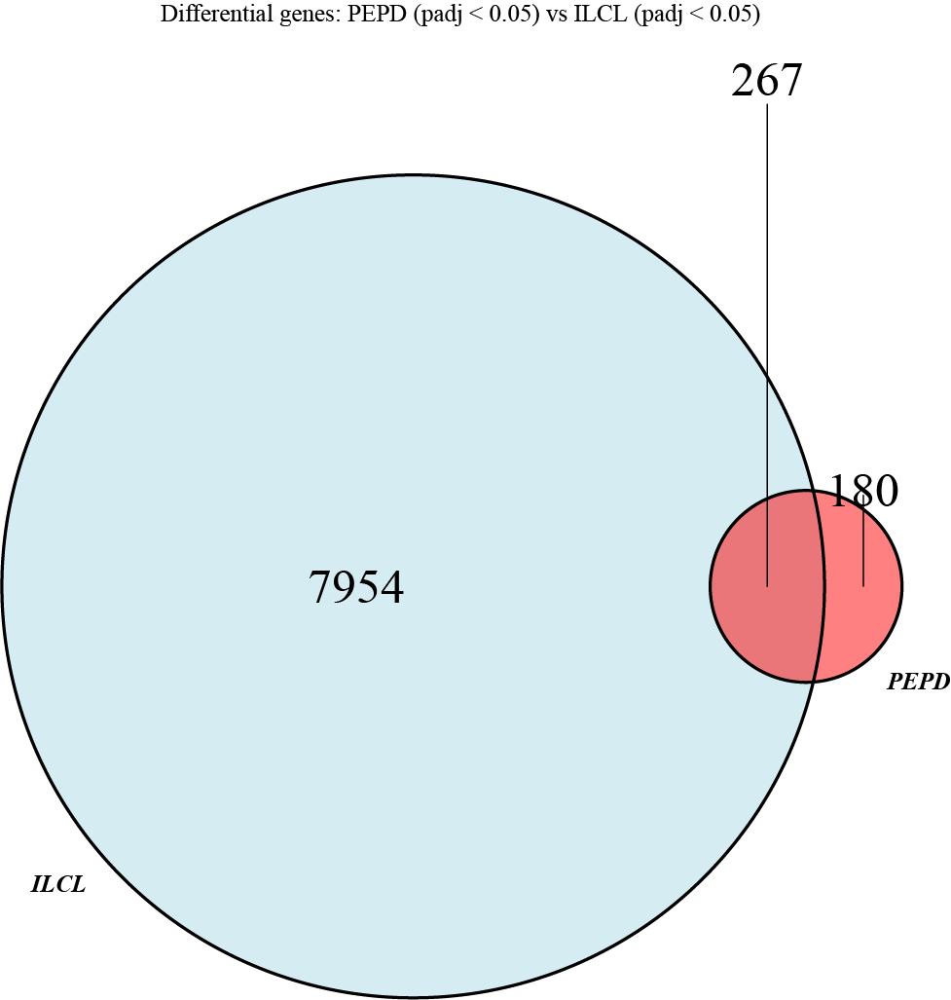

2020.07.13 - Ben Keith

# Downstream RNA-seq Analysis Tutorial

This is a basic tutorial for performing downstream analyses and plotting such as:

- Differential expression analysis (DESeq)
- Batch and covariate correction
- MA plots
- Volcano plots
- Heatmaps (Hierarchical Clustering)
- Boxplots
- Venn plots
- Principal Components Analysis (PCA)
- Enrichment analyses (both within R and externally through tools such as Enrichr)

This analysis concentrates on the analysis of human data, but files for mouse data (mm10) can be changed out to produce the exact same outputs.

Other useful tutorials with more in depth information on some of the tools used here:

- [DESeq2](http://bioconductor.org/packages/release/bioc/vignettes/DESeq2/inst/doc/DESeq2.html)
- [Analysis of RNA-seq data](https://bioconductor.org/packages/release/workflows/vignettes/rnaseqGene/inst/doc/rnaseqGene.html)
- [Enhanced Volcano](https://www.bioconductor.org/packages/release/bioc/vignettes/EnhancedVolcano/inst/doc/EnhancedVolcano.html)
- [PCAtools](https://bioconductor.org/packages/release/bioc/vignettes/PCAtools/inst/doc/PCAtools.html)
- [Complex Heatmap](https://jokergoo.github.io/ComplexHeatmap-reference/book/) and Complex Heatmap [FAQs](https://bioconductor.org/packages/release/bioc/vignettes/ComplexHeatmap/inst/doc/most_probably_asked_questions.html)

<ins>Recommended Tool List (07.15.2020 - R 3.6.0)</ins>

- Differential analysis - DESeq2
- Batch correction - limma (removeBatcheffects), sva
- General plotting - ggplot2, ggrepel, gplots, plotly, RcolorBrewer
- Data wrangling - plyr, dplyr, tidyverse
- PCA - PCAtools/base R prcomp.
- Heatmaps/clustering - Complex Heatmaps/ConsensusClusterPlus
- Pathway analysis - enrichR
- Venn plots - VennDiagram, GeneOverlap
- Volcano plots - EnhancedVolcano

### Which R version (3.6.0), installing packages, and setting up the analysis environment

At the time of writing, all packages used in this tutorial are compatible with R 3.6.X. I recommend R 3.6.0, but with the release of R 4.0, bioconductor packages will gradually shift to R > 4.0.

All packages will be installed through:

```
install.packages('packageName')
```

or

```
BiocManager::install('packageName')
```

or

```
devtools::install_github('git/package')
```

##### Ben's function file

For some of the analyses mentioned here, you will need to source a file into your environment to have access to a number of functions. The file, called _RNAseqFunctions.R_ is in the downstreamAnalysis folder of the snakemake_RNA git. Once in R, use the command:

```
source("path/to/RNAseqFunctions.R")
```

The first time you try to do this, will probably get prompts that a specific package is not installed. Keep installing the required packages and resourcing the file until everything loads correctly and the functions are listed in your global environment.

##### Count, Metadata, lookup Files, and filtering samples based on some criteria.

To perform this analysis, you will need a count a metadata file containing information about each of your samples. The count file may have already been generated by the snakemake RNA pipeline, although a custom count matrix file can be generated by following the instructions in the _Custom_count_matrix_generation.md_ tutorial. The links to the RNA-seq analysis and DESeq2 documentation above provide more information about how these files should be formatted, but I use a couple of custom functions for importing these files into the environment:

```
coldata <- read_delim("metadataFile.txt", delim = "\t", col_names = TRUE)
coldata <- tibble2dataframe(coldata)
cts <- read_delim("countMatrix.txt", delim = "\t", col_names = TRUE)
cts <- tibble2dataframe(cts); cts <- round(cts);

# THIS MUST RETURN TRUE!
all(rownames(coldata) == colnames(cts))
```

**For DESeq the rownames of the metadata table must equal the column names of the count file.**

By importing the data as a tibble, rather than a data frame, you can fix data type issues that might arise further downstream in the analysis. Some functions I use require a data frame, though, so I convert back to a data frame but retain the correct data type for each column.

The last pre-analysis piece you set up you will have do is regarding the import of a lookup file for converting ensembl IDs to gene IDs. The files _"GENOMEBUILD_ensembl2gene.txt"_, can be found in the downstreamAnalysis folder of the snakemake_RNA git repo and can be loaded into your environment like any other file:

```
ens2gene <- read.table(hg38_ensembl2gene.txt", sep="\t", header = TRUE)
```

For safety and compatibility with my functions, name this _ens2gene_. As well as gene ID conversion information, this file also provides gene biotype information for filtering specific genes, such as protein coding or lncRNAs, from you dataset.

Lastly, there is often a need to filter down your imported coldata and count file based on some criteria. I use a wrapper that filters both the coldata and count file based on some criteria in the coldata file, saving both objects into a list. For example, if you wanted to filter only Crohn's disease samples with a quality score (TIN) greater than 70, this would look like:

```
# NOTE: In this example coldata file, disease status was found under the column
# "status" and TIN score under the column "TIN_med"
# NOTE: The matchingColumn argument point to the name of the column in the
# coldata that links to the column names in the count file. i.e. the column
# the allows the two objects to be matched.
# NOTE: The filterString argument must be wrapped by the "quote()" function. The
# syntax of this filter is standard for R subsetting, where "&" can be used for
# dependent conditions and "|" for independent conditions.
filteredData <- filterData(coldata, cts, matchingColumn = "sample",
  filterString = quote(status == "CD" & TIN_med > 70))

# If you're not comfortable working with list objects, separate out the list
# like so
cts.filtered <- cts.filterData(filteredData)
coldata.filtered <- coldata.filterData(filteredData)
```

### Downstream analysis

Going into this section, I assume you have your **count matrix**, **metadata**, **lookup file** and **function file** in your environment.

##### DESeq2

The example below provides very simple DESeq analysis example when you have identified the condition or variable that you want to test for. DESeq2 is a very well documented tools, and more information can be found in Mike's vignettes.

```
dds <- DESeqDataSetFromMatrix(countData = cts,
                              colData = coldata,
                              design = ~ status)

dds <- DESeq(dds)

# The contrast argument here is ensuring that +ve log2FC means higher
# in CD samples.
results(dds, contrast = c("status", "CD", "NIBD"))

# Adding gene ID and biotype columns to our results output
res$ensembl <- rownames(res)
res <- join(as.data.frame(dds), ens2gene, by="ensembl")

# Ordering the output by adjusted p-value
res <- res[order(res$padj),]
```

In some scenarios, there will be a number of covariates in your design formula and sometimes there may be a number of numerical covariates. To avoid issues. it is important that these numerical covariates are on the same scale. This can be easily done using something like the below:

```
dds <- DESeqDataSetFromMatrix(countData = cts,
                              colData = coldata,
                              design = ~ batch + age + TIN + status)

dds$age <- centerAndScale(dds$age)
dds$TIN <- centerAndScale(dds$TIN)
dds <- DESeq(dds, minRep=Inf)
```

Your results can be exported using a command like below:

```
write.table(res, file = "DESeq_results.txt", sep="\t", quote=FALSE, col.names=NA)
```

##### Quick word on batches and corrections
DESeq should be performed **without any normalization or correction** of the data. later I will mention a few different ways that batches and covariates can be corrected, but the count matrix that is input into DESeq should not be modified. Instead any covariates or batches should be entered into the DESeq design formula.

#### Enrichment and pathway analyses

Enrichment and pathway analyses are a great way to get a general sense of the pathways and functions that are overrepresented within your dataset. After performing DESeq, a common next step for us is to take the genes with padj < 0.05 and see what they have in common through enrichment and pathway analyses. A great tool we use often here is Enrichr, which takes a gene list as import and perform enrichment analyses across a number of relevant functional, pathway, and disease databases.

I usually do this analysis in a couple of always:

- Use your output DESeq results to find the list of genes you want and simply copy the gene list of interest into https://amp.pharm.mssm.edu/Enrichr/.
- Use the Enrichr R tool, example shown Below

```
library(enrichR)

# Pull out a gene list of interest
# Here I can taking significant genes with a log2FC > 0
upGenes <- filter(as.data.frame(res), padj < 0.05, log2FoldChange > 0)$gene_id

#specify the databases of interested (http://amp.pharm.mssm.edu/Enrichr/#stats for available databases)
dbs <- c("Reactome_2016","KEGG_2019_Human","GO_Biological_Process_2018")
upEnriched <- enrichr(upGenes, dbs)
```

The dataframe "upEnriched" will then contain outputs for the input list for each database you have compared against.

#### Volcano and MA plots

Using your DESeq results object, _res_, you plot the data in a number of useful ways. A couple of plots we regularly use are volcano and MA plots.

For volcano plots, I use the package EnhancedVolcano, which is really well documented and can probably be modified for anything you're trying to plot.

```
EnhancedVolcano(res, lab = res$gene_id, pLabellingCutoff = 2E-61,
                x = "log2FoldChange", y = "padj", ylab = bquote(~-Log[10]~italic(P)~adjusted),
                FCcutoff = 1, pCutoff = 0.05, colAlpha = .8, pointSize = 1,
                drawConnectors = TRUE, widthConnectors = 0.2, legendPosition = "bottom",
                title = "CL vs IL",
                subtitle = "FC thres = 1, pCutoff = 0.05, plabelling , 2E-61 ",
                legendLabels = c("NS", bquote(~-Log2~FC), bquote(~italic(P)~"adj"),
                                 bquote(~italic(P)~adj~"&"~-Log2~FC)),
                ggsave("volcano_ILCL.pdf", device = "pdf"))
```


Other potential parameters of interest:
- selectLab - Allows you to pass a vector of genes names to label specific genes
- colCustom - pass a vector of color names of hex values to color points to a custom filter

I produce MA plots using ggpubr. For a quick glance, you can produce MA plots straight after performing DESeq using the function:

```
plotMA(res)
```

For nicer looking plots, we can use the ggmaplot function:

```
maplot <- ggmaplot(res, fdr = 0.05, fc = 1, size = 1,
                   palette = c("red2", "royalblue", "darkgray"),
                   genenames = as.vector(res$gene_id),
                   ggtheme = ggplot2::theme_minimal(),
                   legend="top", font.label = c("bold", 10),
                   label.rectangle = FALSE, font.legend = c("bold",12),
                   font.main = "bold",
                   top = 10)
maplot <- maplot + ylim(c(-10,10)) + ggsave("maplot_ILCL.png", device = "png")
```


Other potential parameters of interest:
- label.select - Here I am plotting the top 10 genes in terms of padj (top = 10), but you can select genes by passing them through the parameter label.select. At the time of writing, the version of ggpubr that I am using does not have this parameter available through the bioconductor version of ggpub, so you may need to install ggpubr from the developers github!

#### PCA

**NOTE** The example I am giving here is using my own custom PCA functions, but a recently released package called PCAtools (referenced at the top of this documentation) by the developer of Complex Heatmap should be used by the lab going forward. If you need to quickly produce a PCA plot, feel free to use the code below.

PCA can be performed as part of your QC as well as a part of the downstream analysis to visualize differences among your samples. PCA well detect large sources of variance within your dataset. With this in mind, a number of things can affect PCA and must be taken into account:

- Batch effects
- Uncorrected covariates (transcript integrity, specific cell-type proportion differences, sex, age)
- Number of genes as input
- outliers genes (genes anomalously highly expressed in one or a small subset of samples)

Along with the above, PCA assumes that your data is normally distributed, which means that the input data must be normalized and transformed. The below code will take you through from raw count data to a PCA plot using a subset of protein-coding genes where filtering has been performed to remove potential outlier genes. **For correcting for batch effects, refer to the _Batch effects_ section.**

```
# Data normalization
dds <- DESeqNormalize(counts = cts, coldata = coldata, designFormula = ~ status)

# Transform data
vsd <- transformData(dds, trans="vst", blind=TRUE)
vsd <- as.data.frame(assay(vsd))

# Threshold and filter genes by biotype
# hist(as.matrix(vsd)) to view the general distributions of values to select a normThres
# table(coldata$variable) to see how sample numbers break down. You want to select a value for
# sampleThres less than or equal to the LOWEST number of samples in the variable of interest to
# avoid filtering out group-specific genes.
# table(ens2gene$biotype) to view the possible biotypes that you could filter for.
vsd.pcThres <- thresholdBiotype(vsd, normThres = 5, sampleThres = 6, biotype = "protein_coding")

# Variance filter
vsd.pcThres.var <- varFilter(vsd.pcThres, variableGenes = 500)

#PCA
rnaSeqPCA(vsd.pcThres.var, coldata, color = "subtype", \
  savePlot = TRUE, saveTitle = "pca_ILCL", legend = TRUE, pointSize = 5, plotLabs = TRUE)

```


rnaSeqPCA has a number of functions that may be useful:
- the _proportional_ flag can be set to creat a PCA plot that is proportions to the variation to the axes of interest.
- _x_ or _y_ parameters can be set to look at a specific PC, e.g. x = "PC2", y = "PC3" would plot PC2 vs PC3
- The _loadings_ flag can be set to TRUE to output PCA loadings for the top 5 PCs. The ens2gene object must be present in the environment as this function also binds gene names and biotypes.
- The _plotly_ flag can be set to TRUE to produce an interactive plots (Mac  only :()
- The _returnData_ flag can be set to TRUE and pointed into a variable to save the PC values for each sample, which is useful for performing correlation analyses of PCs and covariates.

#### Heatmaps and Hierarchical Clustering

The Complex Heatmaps package I use for heatmaps is very well documented (links at the top of the page). This is a brief example of how to produce a plot using this package, but the documentation for this package should be referenced for all available options and parameters.

```
# The starting point here is normalized/transformed data that may have been
# corrected (if necessary), with a subset of genes taken for clustering.
# I am used the same 500 genes used in the PCA plot above.

# scale/center data
z.mat <- t(scale(t(vsd.pcThres.var), center = TRUE, scale=TRUE))

# set the color scale for the heatmap
myPalette <- c("blue3", "ivory", "red3")
myRamp = colorRamp2(c(-2, 0, 2), myPalette)

# add variables of interest color annotations (this can be similarly done for the rows)
ann <- data.frame(Subtype = coldata.W$subtype, Status = coldata.W$status,
                  Age = coldata.W$ageSampleCollection)
annColors <- list(Age = colorRamp2(c(14,81), c("#9900cc", "#f8eb01")),
                     Subtype = c("CL"="#0000FF", "IL"="#F60000", "NIBDcolon"="#000000"),
                     Status = c("CD"="#0a9618", "NIBDcolon"="#000000"))
colAnn <- HeatmapAnnotation(df = ann, col = annColors, show_legend = TRUE,
                            annotation_height = 0.5, show_annotation_name = TRUE, annotation_name_side = "left")

#plotting
png("heatmap_ILCL.png")
Heatmap(z.mat, name="z-score", top_annotation=colAnn, col = myRamp,
        show_row_names = FALSE, show_column_names = FALSE, cluster_rows = TRUE,
        cluster_columns = TRUE, show_column_dend = TRUE, show_row_dend = TRUE,
        row_dend_reorder = TRUE, column_dend_reorder = TRUE,
        clustering_method_rows = "ward.D2", clustering_method_columns = "ward.D2",
        clustering_distance_rows = "euclidean", clustering_distance_columns = "euclidean")
dev.off()
```


#### Boxplots

Boxplots or dotplots are really useful to visualize count data for a particular gene across groups of samples. In these examples, I am using normalized and transformed data, but you can use data from any count based source. This isn't a guide to ggplot, but this will give you a couple of example commands that you can adapt and play around with in your own project.

For the gene of interest, I usually add the counts to the coldata and plot using the coldata as input. In example I am adding ACE expression to the coldata data frame and plotting ACE expression across IBD subtypes. These subtypes are specified in the coldata under the column "subtype".

```
# Adding ACE2 to the coldata. The ensembl ID conversion is performed using the
# ens2gene lookup file. example command: ens2gene[ens2gene$gene_id == "ACE2",]$ensembl
coldata$ACE2 <- as.vector(t(vsd.pcThres.var["ENSG00000130234.6",])[,1])

ggplot(data = coldata, aes_string(x = "subtype", y = "ACE2")) + # pointing to two columns in the coldata
  geom_boxplot(outlier.shape = NA) +
  geom_jitter(height = 0, width=0.3, size = 2.5, aes_string(color="subtype")) + # jitter is a function that prevents a column of dots along the center of a group. make sure the height jitter is set to 0!
  theme_minimal() + # I prefer a minimal look to my plots!
  theme(plot.title=element_text(face="bold", size=24),
    axis.title=element_text(face="bold", size=20), axis.text=element_text(size=18, color="black"),
    axis.text.x=element_text(size=20, color="black"), panel.background = element_rect(fill="white",color="black"),
    legend.title=element_blank(), legend.key=element_blank()) + theme(legend.position = "none") +
  labs(x="", y="Normalized ACE2 Expression") +
  scale_color_manual(values=c("#0000FF", "#E60000")) + # specifying specific dot colours
  scale_x_discrete(limits=c("Colon-like", "Ileum-like")) # Controlling the order of groups along the x-axis
```


\
Below is a slightly different variation of the same plot.

```
ggplot(data = coldata, aes_string(x = "status", y = "ACE2")) +
  geom_jitter(height = 0, width=0.3, size = 2, aes_string(color="subtype")) +  
  geom_boxplot(outlier.shape = NA, alpha=0.3, aes_string(color="subtype")) +
  theme_minimal() +
  theme(plot.title=element_text(face="bold", size=24), axis.title=element_text(face="bold", size=20),
    axis.text=element_text(size=14, color="black"),
    axis.text.x=element_blank(), panel.background = element_rect(fill="white",color="black"),
    legend.title=element_blank(), legend.key=element_blank()) +
  labs(x="", y="Normalized/Transformed ACE2 Expression") +
  scale_color_manual(values=c("#0000FF", "#E60000"))
```


#### Venn plot

Venn's can be useful to visualize the differences between two different gene sets, for example that are output from DESeq. To do these plots, I use a wrapper around the functions from the VennDiagram package in R. This wrapper will output p-values of the overlap between the groups, an output diagram, and the gene lists for the 3 groups in the plot.

The inputs for this wrapper are two DESeq results objects with gene_ids mapped (as shown in the DESeq section). Before using my wrapper vennPlot function, I filter both results objects to include the genes I'm interested in comparing.

```
res.CCP.filter <- filter(res.CCP, padj < 0.05)
res.ILCL.filter <- filter(res.ILCL, padj < 0.05)

overlap <- vennPlot(res.CCP.filter, res.ILCLsubtype.filter, saveTitle = "PEPDvsILCL_DE",
  title="Differential genes: PEPD (padj < 0.05) vs ILCL (padj < 0.05)", listNames = c("PEPD", "ILCL"))
```

OUTPUT:

```
Detailed information about this GeneOverlap object:
listA size=447, e.g. ENSG00000183844.12 ENSG00000134955.7 ENSG00000115386.5
listB size=8221, e.g. ENSG00000104267.5 ENSG00000137634.5 ENSG00000019102.7
Intersection size=267, e.g. ENSG00000134955.7 ENSG00000115386.5 ENSG00000203306.3
Union size=8401, e.g. ENSG00000183844.12 ENSG00000134955.7 ENSG00000115386.5
Genome size=25000
# Contingency Table:
      notA inA
notB 16599 180
inB   7954 267
Overlapping p-value=8e-32
Odds ratio=3.1
Overlap tested using Fisher's exact test (alternative=greater)
Jaccard Index=0.0
```



#### Batch and covariate correction

Batch correction is a well documented and well commented topic across various vignettes on bioconductor and through numerous threads on biostars. Normally, you will want to perform these corrections when your data has been sequences across numerous batches, or when a significant proportion of the variation is attributed to some kind of technical or experimental artifact. Sometimes we can confidently assign values to these artifacts to easily correct them away using linear regression, but in other cases, these are tools we can use to calculate these covariates for us.

As a quick summary of some of the initial questions I had when first approaching batch correction:

**What correction do I need to do prior to DESeq?**

None. Raw counts should always be the input to DESeq and the batches/covariates that we would like to correct for should be included in the design formula. (NOTE: there are tools being released that _do_ perform correction to raw counts before DE tools, like [ComBat-seq](https://github.com/zhangyuqing/ComBat-seq). At the time of writing, I have no experience in using these tools, but the may before common/incorporated into DESeq2 in the future).

By including these covariates and batches in the design formula for DESeq, the output results will have taken these covariates into account when performing differential expression analyses.

**Can I use DESeq when I want to correct my data for things like PCA and hierarchical clustering?**

We can use DESeq to normalize our data, but we will have to use tools like [SVA (section 4)](https://bioconductor.org/packages/release/bioc/vignettes/sva/inst/doc/sva.pdf), [Combat (section 7)](https://bioconductor.org/packages/release/bioc/vignettes/sva/inst/doc/sva.pdf), or limma's ["removeBatchEffects"](https://rdrr.io/bioc/limma/man/removeBatchEffect.html) to correct our normalized and transformed data. There are certain scenarios when we prefer to use one tool over another, and this will be explained further in this section.

**Which batch correction tool do I use?**

It depends. In an analysis, like a lot of our mouse studies, where we have controlled for lot of factors such as genetic background and the general expected heterogeneity between samples in the same group, the main expected differences between samples in different groups would be the treatment or condition. Obvious QC outliers aside, we may therefore expect that other sources of variation in our data are down to technical of experimental artefacts. In these scenarios, we can use tools like SVA to control for variation attributed to our biological factor of interest while correcting for other differences between our samples that may contribute to the largest sources of variance within our data. **It should be noted that this types of correction methods should not be an initial go to (in my opinion), I think it is always best to perform the analysis initially without corrections and use these tools only when necessary.**

While tools like SVA are great when we know what biological variation we're looking for, they _should not_ be used when we're trying to detect unknown sources of variation. For example, in our colon tissue CD project, we were trying to identify novel CD subtypes. If we were to use a tool like SVA, we may have been removing real biological variation from our dataset. In cases like this, we need to correct for technical variation using covariates that we can demonstrate as being correlated with variation across our samples (examples shown in this section). For this type of scenario we use a function within the limma package called "removeBatchEffects", which is a wrapper for a simple linear regression model.     

<ins>Accounting for batching and covariates in DESeq - **DESeq2 design formula**<ins/>

For all DESeq related issues and queries, the various documentation and vignettes that Mike has put out (along with him being really attentive to question on various forums) will almost certainly answer your question. This section is to briefly introduce how you might account for batches and covariates and how to deal with a particular scenario we encounter during the analysis of our colonic CD data.

Accounting for batches and covariates when performing DESeq is really easy. In an analysis where you would need to correct for batch while looking for differences across one variable, you would set up your analysis like this:

```
dds <- DESeqDataSetFromMatrix(countData = cts,
                              colData = coldata,
                              design = ~ batch + status)

dds <- DESeq(dds)
```

By including batch in the design formula, DESeq will account for differences in batch when performing differential gene expression analysis. **Mike recommended placing the covariate of interest at the end of the design formula**

Numeric covariates can also be included design formula in the same way, **but it is important that these numeric covariates are on the same scale**. For example, we performed an analysis in the past where we included a proportion (0-1) and age (25-85) as covariates in our design formula. Since these are on different scales, this causes converge issues for DESeq's GLM, resulting is strange results that did not correlate with what we observed in our downstream analyses. Therefore, in scenarios like this, you get solve this issue be doing something like the below:

```
dds <- DESeqDataSetFromMatrix(countData = cts,
                              colData = coldata,
                              design = ~ batch + IECAve + ageSampleCollection + status)

dds$IECAve <- centerAndScale(dds$IECAve)
dds$ageSampleCollection <- centerAndScale(dds$ageSampleCollection)
dds <- DESeq(dds, minRep=Inf)
```

The centerAndScale function is included in the function script, but for reference all this is doing is subtracting the mean and dividing by the standard deviation:

```
centerAndScale <- function(x) (x - mean(x)) / sd(x)
```

Although this allows to perform differential analyses taking into account batches and covariates, we need to perform additional steps for downstream analyses that involve visualization of our data (PCA, clustering).

<ins>Correcting for known Batches and technical covariates - **removeBatchEffects**<ins/>

For us, the most common way that we identify these factors is through initial PCAs. Sometimes these are more obvious (usually batch), but other times we may need to dig a bit deeper into our QC metrics to determine whether what we're seeing is due to underlying biology, or technical/experimental/acquisitional differences between our samples. Below is a simple example that can probably be applied to your data.

```
# Data normalization
dds <- DESeqNormalize(counts = cts, coldata = coldata, designFormula = ~ status)

# Transform data
vsd <- transformData(dds, trans="vst", blind=TRUE)
vsd <- as.data.frame(assay(vsd))

# Subset 500 most variable genes for PCA
vsd.var <- varFilter(vsd, variableGenes = 500)

rnaSeqPCA(vsd.var, coldata, color = "subtype")
```


\
Although it looks like PC2 is driven by our variable of interest, something is going on here with PC1. By colouring the points by batch...


\
...we can clearly see that batch is driving PC1, and therefore drives a significant proportion of the variability within this dataset. Below I correct for this using a wrapper of limma's removeBatchEffects on data that has been normalized and transformed

```
# batch correction
batch <- coldata$batch
vsd.batch <- limmaCorrect(transData = vsd, batch = batch)

# Subset 500 most variable genes for PCA
vsd.batch.var <- varFilter(vsd.batch, variableGenes = 500)

rnaSeqPCA(vsd.batch.var, coldata, color = "subtype")
rnaSeqPCA(vsd.batch.var, coldata, color = "batch")
```


\
It worth noting here that in some analyses, like our colonic tissue CD analysis, the batches are very heterogeneous and contain difference numbers of samples. In these analyses, where you would probably want to remove outlier samples or samples with low QC scores, it is worth performing the batch correction _before_ filtering these samples out. Hopefully be performing the analysis in this order, we increase our power for corrected these effects out of the data.

In some other, not so obvious scenarios, we may be able to detect covariates that are highly variable across our data, and therefore correlate with PCs. In the data used in the above examples, a covariate that we identified as highly variable was the proportion of Intestinal Epithelial Cells (IECs) that were predicted in our tissue samples through deconvolution analyses using DESeq's unmix function. The following is an example of how you might go above showing this significant correlation.

```
# The input here is the batch corrected data that was used in the previous examples
rnaSeqPCA(vsd.batch.var, coldata, color = "IECAve")
```


```
# The return data argument allows you to perform correlation analyses between metadata
# and PC values for each sample.
pcaData <- rnaSeqPCA(vsd.batch.filt.var, coldata, color = "IECAve", returnData=TRUE)
cor.test(pcaData$PC2, pcaData$IECAve)
```

```
Pearson's product-moment correlation

data:  pcaData$PC2 and pcaData$IECAve
t = 5.268, df = 115, p-value = 6.511e-07
alternative hypothesis: true correlation is not equal to 0
95 percent confidence interval:
0.2819530 0.5763216
sample estimates:
    cor
0.4409181
```

From this, we can see that there is a significant correlation with IEC proportion, suggesting that we should correct for this! The correction line in our script here would look like:

```
batch <- coldata$batch; IEC <- coldata$IECAve
vsd.batch <- limmaCorrect(transData = vsd, batch = batch, covariate = IEC)
```

With a particularly heterogeneous dataset, we may want to correct for multiple covariates while retaining variation associated with a particular covariate. Here, our correction step would look something like this:

```
batch <- coldata$batch; IECAve <- coldata$IECAve; status <- coldata$status;
TIN_med <- coldata$TIN_median; age <- coldata$ageSampleCollection

# Note the use of the cbind function in the covariate argument and the
# model.matrix function in the design argument. This design argument means
# that we want to retain variation association with disease status.
vsd.BISAT <- limmaCorrect(transData = vsd, batch = batch,
  covariate = cbind(IECAve, age, TIN_med), design = model.matrix(~ status))
```

Unlike with DESeq, we do not need to worry too much about centering and scaling our numeric covariate as removeBatchEffect uses a closed form equation that should not fail to converge like the iterative GLM used by DESeq2.

Although for this example I have been using the output from limmaCorrect for PCA, this data frame can be used in analysis that would usually require a normalized and transformed dataset as input.

<ins>Correcting for unknown technical variation - **SVA** and implementation in DESeq</ins>

In this example I am using data from Erin's Peanut-sensitive CC027 mouse samples. Here, the study design is perfect for us to take advantage of tools like SVA. Since we have controlled for environment, sample acquisition, and treatment, we would expect the majority of variation (outside of technical variation) to be due to peanut sensitization. Reach out to Terry, Shehzad, or Erin if you like to learn more about this study.

With this in mind, we found that PC1 was not driven by peanut sensitization, and so we wanted to use SVA to control for and sources of technical variation.

```
# Normalize data and remove lowly expressed genes.
dds <- DESeqNormalize(counts = cts, coldata = coldata, designFormula = ~ timepoint)
dat  <- counts(dds, normalized = TRUE)     # extracting deseq normalized counts
idx  <- rowMeans(dat) > 1     # removing lowly expressed genes (uninformative for surrogate variable identification)
dat  <- dat[idx,]     # filtering based on above indices

#identifying surrogate variables using sva
mod  <- model.matrix(~ timepoint, colData(dds))     # full design model
mod0 <- model.matrix(~ 1, colData(dds))     # remove variables we want to retain variation for
svseq <- svaseq(dat, mod, mod0, num.sv(dat, mod))    # perform svaseq, "num.sv(dat, mod)" used in place of a manual n.sv to automatically the number of surrogate variables
```

At this point we have identified our surrogate variables that we can use correct our data for downstream analyses and to perform DESeq taking these surrogate variables into account.

First we perform DESeq

```
ddssva <- dds
ddssva$SV1 <- svseq$sv[,1]  # add surrogate variable to the design formula.
## NOTE:In this example there was only 1 SV, but in your analysis there may be numerous SVs!
## The function num.sv(dat, mod), which is used above, can be used to tell you the number of SVs in your dataset.

design(ddssva) <- ~ SV1 + timepoint     # edit the design formula for DESeq adding in SVs.

ddssva <- DESeq(ddssva)

# perform results extraction as normal from this point!
```

To correct the data for analyses like clustering and PCAs

```
# Transform data
vsd <- transformData(ddssva, trans="vst", blind=TRUE)
vsd <- as.data.frame(assay(vsd))

# Using correction wrapper in function file
timepoint <- coldata$timepoint
vsd.clean <- svaCorrect(vsd, model.matrix(~ timepoint), svseq$sv)     # correcting normalized/transformed counts based on sva output
```

This data matrix than be used in various ways. Either filtered for some particular biotype, filtered for X variable genes, or used in clustering or PCA.
